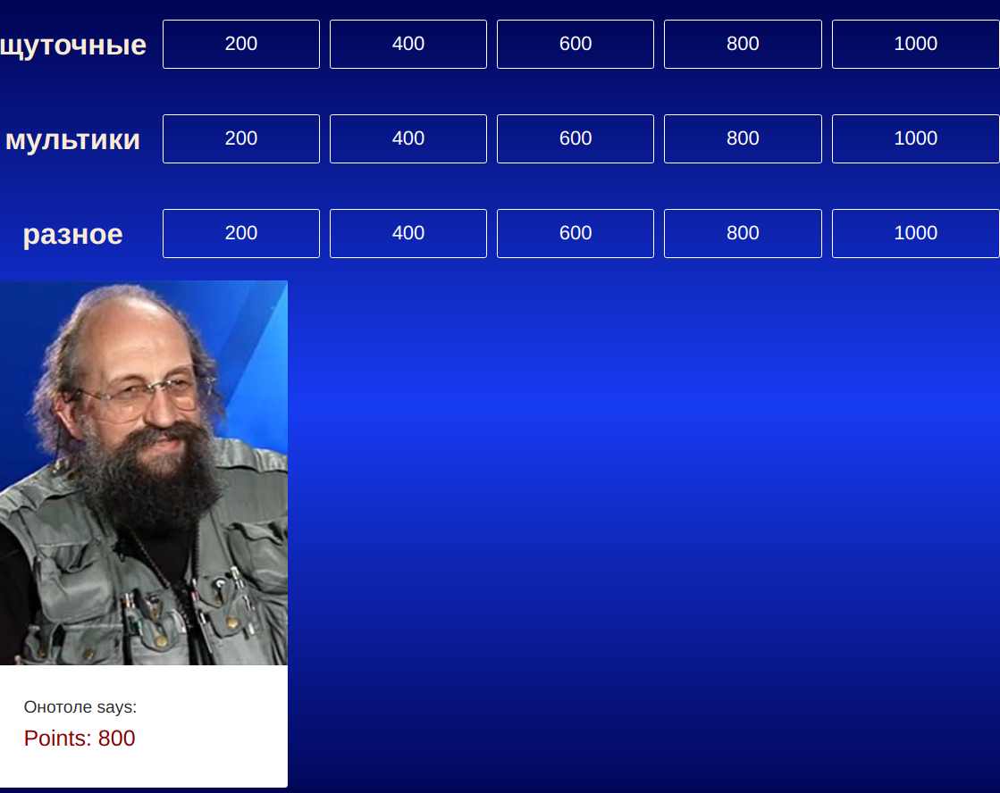
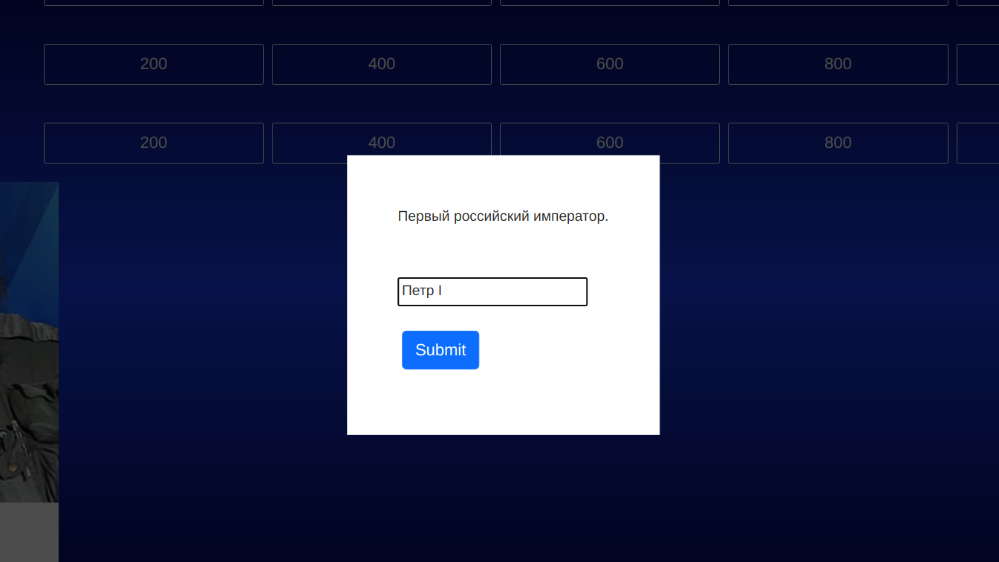

# Своя игра

## Введение

Веб-приложение на основе телепередачи "Своя игра".
Подробнее с данной телевизионной игрой можете ознакомиться [тут](https://ru.wikipedia.org/wiki/%D0%A1%D0%B2%D0%BE%D1%8F_%D0%B8%D0%B3%D1%80%D0%B0).
Ниже приведена картинка, демонстрирующая поле выбора вопросов.



**Рисунок 1. Поле выбора вопросов**




**Рисунок 2. Модальное окно для ввода ответа на вопрос**

## Функциональность

В данном приложении вы можете поучаствовать в викторине: выбирать категорию и отвечать на вопросы, за которые зарабатываются очки. Сумма очков подсчитывается в левом нижнем углу экрана.


## В планах

1. Сделать недоступными вопросы, на которые получен ответ,
2. Реализовать регистрацию и аутентификацию игроков с помощью cookies и сессий.

## Запуск
В папках my-app/src и server запустить команду
```bash
npm start
```

